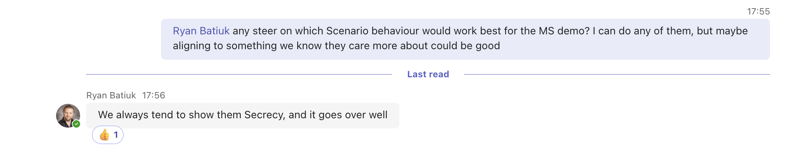

# Model Monitoring Demo

## Stepts to complete

1. ~~Determine the use-case~~  
Secrecy selected!

2. Design the scenario simulation  
Simulate a scenario where the abundance of language of interest decreases over time.  

    Q1 Confidence scores | Q2 Confidence Scores | Q3 Confidence Scores | Q4 Confidence Scores
    ---------------------|----------------------|----------------------|---------------------
    0.99 | 0.01 | 0.56 | 0.11
    0.99 | 0.01 | 0.56 | 0.11
    0.99 | 0.01 | 0.56 | 0.11
    0.99 | 0.01 | 0.56 | 0.11

3. Design the monitoring Dashboard  
Can the dashboard be an embedded streamlit app, running inside the notebook?

__Input Data Monitoring__
1. Communication count
2. Alert Count